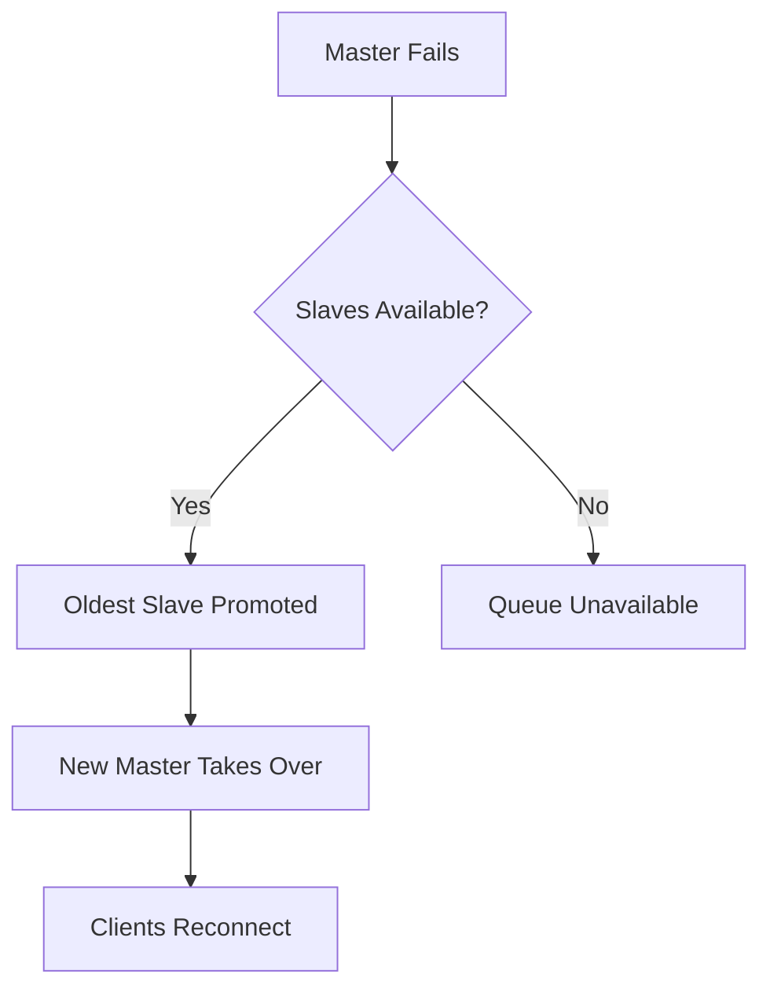
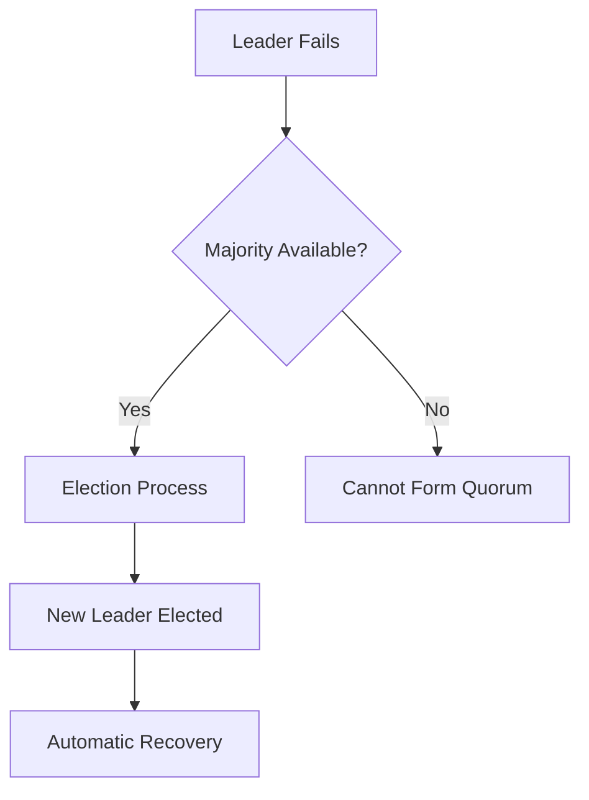

# RabbitMQ Complete Tutorial: From Zero to Understanding Your Output

## Part 1: What is RabbitMQ? (The Basics)

### The Restaurant Analogy

Imagine a busy restaurant:
- **Customers** = Tasks that need to be done
- **Waiters** = Producers (like Airflow Scheduler)
- **Kitchen** = Workers (like Celery workers)
- **Order tickets** = Messages
- **Order window** = Queue

**Without RabbitMQ**: The waiter would have to stand at the kitchen door, waiting for the chef to be ready. If the chef is busy, the waiter is stuck waiting.

**With RabbitMQ**: The waiter puts order tickets on a spike at the order window. Chefs take tickets when they're ready. The waiter can go serve other customers.

### Why Do We Need RabbitMQ?

RabbitMQ is a **Message Broker** - it's like a postal service for computer programs:
- **Stores messages** until they can be processed
- **Routes messages** to the right destination
- **Guarantees delivery** (messages won't get lost)
- **Handles traffic** (if workers are busy, messages wait in line)

## Part 2: RabbitMQ Core Concepts

### 1. **Messages**
```
A message is like a letter:
┌─────────────────┐
│  Message        │
│ ─────────────── │
│ Task: Run script│
│ Data: {id: 123} │
│ Priority: High  │
└─────────────────┘
```

### 2. **Queues**
A queue is like a mailbox - messages wait here until someone picks them up:
```
Queue: "default"
┌─────────────────────────────────────┐
│ [Msg1] [Msg2] [Msg3] [Msg4] [Msg5]  │ ← Messages waiting
└─────────────────────────────────────┘
         ↓
    Worker picks up Msg1
```

### 3. **Exchanges**
An exchange is like a postal sorting office - it decides which queue gets which message:
```
                Exchange
                   │
    ┌──────────────┼──────────────┐
    │              │              │
    ↓              ↓              ↓
Queue: A       Queue: B       Queue: C
```

### 4. **Bindings**
Bindings are the rules that tell exchanges how to route messages:
```
Exchange ──binding──> Queue
         (routing rules)
```

### 5. **Virtual Hosts (vhosts)**
Virtual hosts are like separate post offices in the same building:
```
RabbitMQ Server
├── vhost: /           (default)
├── vhost: airflow_host (your Airflow)
└── vhost: other_app
```
## A Simple Example

```
Web App (Producer) → RabbitMQ → Background Worker (Consumer)
    ↓                   ↓              ↓
"Resize photo"    [photo_queue]    Actually resizes
```


```
Airflow Scheduler → RabbitMQ → Airflow Workers
       ↓              ↓            ↓
   "Run Task X"  [airflow_queue]  Execute task
```

## Part 3: Types of Exchanges

### 1. **Direct Exchange**
Routes messages to queues based on exact matching routing key:
```
Message with key "urgent" → Direct Exchange → Queue bound with key "urgent"
```

### 2. **Fanout Exchange**
Broadcasts messages to ALL bound queues (like a megaphone):
```
Message → Fanout Exchange → ALL queues get a copy
```

### 3. **Topic Exchange**
Routes based on pattern matching (like email filters):
```
Message with key "task.vm2.high" → Topic Exchange → Queues matching "task.vm2.*"
```

### 4. **Headers Exchange**
Routes based on message headers (rarely used)

## Part 4: Analyzing Your RabbitMQ Output

### Command 1: `sudo rabbitmqctl list_queues -p airflow_host`

This shows all queues in your Airflow virtual host:

```bash
name    messages
default 0
celery@airflow.celery.pidbox    0
celeryev.dbdae447-48bf-4ecd-933a-aae3f9ce7910   0
celeryev.f599222e-4fc1-4ba6-8d3b-f66ffd4f9aa2   0
```

**Breaking it down:**

1. **`default`** (0 messages)
   - This is your main task queue
   - Where Airflow sends tasks to be executed
   - 0 messages = no tasks waiting (good!)

2. **`celery@airflow.celery.pidbox`** (0 messages)
   - Special control queue for Celery
   - Used for worker management commands
   - Like "shutdown", "restart", "ping"

3. **`celeryev.dbdae447-...`** and **`celeryev.f599222e-...`** (0 messages each)
   - Event queues for monitoring
   - Each worker creates one
   - Used by Flower (monitoring tool)
   - The long IDs are unique worker identifiers

### Command 2: `sudo rabbitmqctl list_exchanges -p airflow_host`

This shows all exchanges (message routers):

```bash
name    type
celery.pidbox   fanout
        direct
amq.topic       topic
amq.fanout      fanout
amq.headers     headers
default direct
amq.rabbitmq.trace      topic
celeryev        topic
amq.match       headers
reply.celery.pidbox     direct
amq.direct      direct
```

**Key exchanges explained:**

1. **`celery.pidbox`** (fanout)
   - Broadcasts control messages to ALL workers
   - When you say "stop all workers", it goes here

2. **`(empty name)`** (direct)
   - Default exchange
   - Routes to queues with same name as routing key

3. **`default`** (direct)
   - Main task routing exchange
   - Sends tasks to specific queues

4. **`celeryev`** (topic)
   - Event routing for monitoring
   - Routes worker events to Flower

5. **`amq.*`** exchanges
   - Built-in RabbitMQ exchanges
   - Usually not used directly

### Command 3: `sudo rabbitmqctl list_bindings -p airflow_host`

This shows how exchanges connect to queues:

```bash
source_name     source_kind     destination_name        destination_kind        routing_key     arguments
        exchange        default queue   default []
celery.pidbox   exchange        celery@airflow.celery.pidbox    queue           []
celeryev        exchange        celeryev.dbdae447-...   queue   #       []
celeryev        exchange        celeryev.f599222e-...   queue   worker.#        []
```

**Understanding each binding:**

1. **Empty exchange → default queue**
   ```
   (default exchange) --[routing_key: default]--> [default queue]
   ```
   - Any message sent with routing key "default" goes to default queue

2. **celery.pidbox → celery@airflow.celery.pidbox**
   ```
   [celery.pidbox] --[broadcast]--> [control queue]
   ```
   - Control messages broadcast to all workers

3. **celeryev → worker event queues**
   ```
   [celeryev exchange] --[pattern: #]--> [worker1 events]
   [celeryev exchange] --[pattern: worker.#]--> [worker2 events]
   ```
   - `#` means "match everything"
   - `worker.#` means "match anything starting with 'worker.'"

## Part 5: What This Tells Us About Your Setup

From your output, we can see:

### 1. **You have 2 Celery workers running**
- Evidence: 2 celeryev queues with different UUIDs
- Each worker creates its own event queue

### 2. **No tasks are currently waiting**
- All queues show 0 messages
- System is not overloaded

### 3. **Standard Celery setup**
- Default queue is configured
- Event monitoring is active (for Flower)
- Control channels are set up

### 4. **Clean system state**
- No dead letter queues
- No custom queues (like vm2_queue, vm3_queue)
- Basic single-queue setup

## Part 6: Common Patterns You'll See

### When Tasks Are Running:
```bash
name    messages
default 5        ← 5 tasks waiting
```

### When You Add Custom Queues:
```bash
name    messages
default 0
vm2_queue 3      ← 3 tasks for VM2
vm3_queue 2      ← 2 tasks for VM3
high_priority 1  ← 1 urgent task
```

### When Workers Are Offline:
```bash
name    messages
default 50       ← Tasks piling up!
```

## Part 7: Useful Commands for Monitoring

### 1. **Check Queue Depths**
```bash
# See how many tasks are waiting
sudo rabbitmqctl list_queues -p airflow_host name messages
```

### 2. **Check Active Consumers**
```bash
# See which workers are connected
sudo rabbitmqctl list_consumers -p airflow_host
```

### 3. **Check Queue Details**
```bash
# Detailed queue information
sudo rabbitmqctl list_queues -p airflow_host name messages consumers memory
```

### 4. **Check Connections**
```bash
# See all connections to RabbitMQ
sudo rabbitmqctl list_connections
```

## Part 8: Understanding Message Flow in Your Airflow

Here's what happens when Airflow runs a task:

```
1. Scheduler creates task
         ↓
2. CeleryExecutor sends to RabbitMQ
         ↓
3. Message goes to Exchange
         ↓
4. Exchange routes to Queue (based on bindings)
         ↓
5. Message waits in Queue
         ↓
6. Worker picks up message
         ↓
7. Worker executes task
         ↓
8. Worker sends result back
```

## Part 9: Troubleshooting Guide

### If you see many messages in queues:
- Workers might be down
- Workers might be too slow
- Too many tasks scheduled

### If you see no workers (no celeryev queues):
- Celery workers not running
- Workers can't connect to RabbitMQ

### If you see connection errors:
- Check RabbitMQ service: `sudo systemctl status rabbitmq-server`
- Check permissions: `sudo rabbitmqctl list_users`
- Check vhost access: `sudo rabbitmqctl list_permissions -p airflow_host`

This foundation will help you understand and debug your Airflow+Celery+RabbitMQ setup. Remember: RabbitMQ is just the messenger - it holds tasks until workers are ready to process them!


=================================================================================   

# Understanding Celery Configuration: A Complete Breakdown

## What is This File?

This is a Celery configuration file that tells Celery HOW to work with RabbitMQ. Think of it as an instruction manual that says:
- Where to put messages (queues)
- How to route messages (exchanges)
- How workers should behave

Let me explain each part like you're learning from scratch.

## Part 1: Imports

```python
from kombu import Queue, Exchange
```

### What is Kombu?
- **Kombu** is Celery's messaging library
- It's like a translator between Celery and RabbitMQ
- Celery speaks "tasks", RabbitMQ speaks "messages", Kombu translates between them

### Real-world analogy:
```
Celery (English speaker) ← Kombu (Translator) → RabbitMQ (Spanish speaker)
```

## Part 2: Exchange Definition

```python
# Define the default exchange
default_exchange = Exchange('default', type='direct')
```

### What's happening here?

1. **Creating an Exchange object**
   - Name: `'default'`
   - Type: `'direct'`

2. **What's a 'direct' exchange?**
   
   Think of it like a postal sorting machine:
   ```
   Letter with address "123 Main St" → Goes ONLY to mailbox "123 Main St"
   
   In RabbitMQ:
   Message with key "remote_tasks" → Goes ONLY to queue "remote_tasks"
   ```

### Visual representation:
```
   Message: "Run script on VM2"
   Routing Key: "remote_tasks"
           ↓
   [Direct Exchange: "default"]
           ↓
   Looks for exact match: "remote_tasks"
           ↓
   [Queue: "remote_tasks"] ← Message delivered here
```

## Part 3: Queue Definitions

```python
# Define queues that will be created in RabbitMQ
task_queues = [
    Queue('default', default_exchange, routing_key='default'),
    Queue('remote_tasks', default_exchange, routing_key='remote_tasks'),
]
```

### Breaking down each queue:

1. **First Queue:**
   ```python
   Queue('default', default_exchange, routing_key='default')
   ```
   - **Name**: `'default'` (the queue's name in RabbitMQ)
   - **Exchange**: Uses the `default_exchange` we defined above
   - **Routing Key**: `'default'` (messages with this key come here)

2. **Second Queue:**
   ```python
   Queue('remote_tasks', default_exchange, routing_key='remote_tasks')
   ```
   - **Name**: `'remote_tasks'`
   - **Exchange**: Same `default_exchange`
   - **Routing Key**: `'remote_tasks'`

### Visual Queue Setup:
```
RabbitMQ after this config:
┌─────────────────────────────────┐
│         Exchange: default       │
│         (type: direct)          │
└─────────────┬───────────────────┘
              │
    ┌─────────┴─────────┐
    ↓                   ↓
┌───────────┐      ┌─────────────────┐
│  Queue:   │      │     Queue:      │
│ "default" │      │ "remote_tasks"  │
└───────────┘      └─────────────────┘
```

## Part 4: Task Routing

```python
# Route specific tasks to specific queues
task_routes = {
    'simple_remote_tasks.run_command': {'queue': 'remote_tasks'},
    'simple_remote_tasks.check_vm_status': {'queue': 'remote_tasks'},
}
```

### What's happening here?

This is like creating delivery rules for specific packages:

1. **First Rule:**
   - If task name is `'simple_remote_tasks.run_command'`
   - Send it to queue `'remote_tasks'`

2. **Second Rule:**
   - If task name is `'simple_remote_tasks.check_vm_status'`
   - Also send it to queue `'remote_tasks'`

### Real-world analogy:
```
Post Office Rules:
- All packages from "Amazon" → Go to truck #1
- All packages from "eBay" → Go to truck #2

Celery Rules:
- All tasks named "run_command" → Go to "remote_tasks" queue
- All tasks named "check_vm_status" → Go to "remote_tasks" queue
```

### In Practice:
```python
# In your tasks.py file:
@celery_app.task
def run_command(cmd):          # Full name: simple_remote_tasks.run_command
    return os.system(cmd)

# When called:
run_command.delay("ls -la")    # → Goes to "remote_tasks" queue
```

## Part 5: Worker Settings

```python
# Worker settings
worker_prefetch_multiplier = 1  # Take one task at a time
task_acks_late = True           # Acknowledge after completion
task_reject_on_worker_lost = True
```

### Let's understand each setting:

#### 1. `worker_prefetch_multiplier = 1`

**What it means**: Worker takes only 1 task at a time

**Restaurant analogy**:
```
Setting = 1: Chef takes 1 order, cooks it, then takes next order
Setting = 4: Chef takes 4 orders at once (might burn something!)
```

**Why use 1?**
- Ensures fair distribution
- If a worker crashes, only 1 task is lost
- Good for long-running tasks

#### 2. `task_acks_late = True`

**What it means**: Worker says "I'm done" AFTER finishing the task

**Two ways to acknowledge**:
```
acks_late = False (default):
1. Worker: "I got the task" (acknowledges immediately)
2. Worker starts working...
3. If worker crashes → Task is lost!

acks_late = True (your setting):
1. Worker gets task (doesn't acknowledge yet)
2. Worker completes task
3. Worker: "I'm done" (acknowledges now)
4. If worker crashes → RabbitMQ redelivers task!
```

**Real-world analogy**:
```
acks_late = False: Signing for a package when delivered
acks_late = True: Signing for a package after opening and checking it
```

#### 3. `task_reject_on_worker_lost = True`

**What it means**: If worker dies, put task back in queue

**Scenario**:
```
1. Worker processing task
2. Worker suddenly crashes (power outage, killed, etc.)
3. RabbitMQ detects lost connection
4. With True: Task goes back to queue for another worker
5. With False: Task is lost forever
```

## Complete Flow Example

Let's trace a task through this configuration:

```python
# 1. You call a task
from simple_remote_tasks import run_command
run_command.delay("backup_database.sh")

# 2. Celery checks task_routes
# Finds: 'simple_remote_tasks.run_command' → queue: 'remote_tasks'

# 3. Message sent to RabbitMQ
# Exchange: 'default' (direct type)
# Routing key: 'remote_tasks'

# 4. Exchange routes message
# Direct exchange matches: routing_key 'remote_tasks' → queue 'remote_tasks'

# 5. Message waits in 'remote_tasks' queue

# 6. Worker configured for 'remote_tasks' queue picks it up
# - Takes only 1 task (prefetch_multiplier = 1)
# - Doesn't acknowledge yet (task_acks_late = True)

# 7. Worker executes: backup_database.sh

# 8. Task completes successfully
# - Worker acknowledges to RabbitMQ
# - Message removed from queue

# OR if worker crashes at step 7:
# - RabbitMQ detects lost connection
# - Message goes back to queue (task_reject_on_worker_lost = True)
# - Another worker can pick it up
```

## Why This Configuration is Good

1. **Separation of Concerns**
   - Default queue: Regular Airflow tasks
   - remote_tasks queue: SSH/remote execution tasks

2. **Reliability**
   - Tasks aren't lost if workers crash
   - One task at a time prevents overload

3. **Scalability**
   - Can add more workers for each queue
   - Can add more queues for different task types

## How to Use This Configuration

1. **Save as** `celery_config.py` in your Airflow directory

2. **Tell Celery to use it**:
   ```python
   # In airflow.cfg or celeryconfig.py
   celery_config_options = 'celery_config.task_queues'
   ```

3. **Start workers for specific queues**:
   ```bash
   # Worker for default queue
   airflow celery worker --queues default
   
   # Worker for remote tasks
   airflow celery worker --queues remote_tasks
   
   # Worker for both queues
   airflow celery worker --queues default,remote_tasks
   ```

## Visual Summary

```
Your Configuration Creates This Setup:
━━━━━━━━━━━━━━━━━━━━━━━━━━━━━━━━━━━

         Tasks from Airflow
              ↓     ↓
         ┌────┴─────┴────┐
         │ Task Router   │
         │ (checks rules)│
         └────┬─────┬────┘
              ↓     ↓
    ┌─────────┴─────┴─────────┐
    │   Exchange: "default"   │
    │    (type: direct)       │
    └─────┬─────────────┬─────┘
          ↓             ↓
    ┌─────┴───┐   ┌────┴──────────┐
    │ Queue:  │   │    Queue:     │
    │"default"│   │"remote_tasks" │
    └─────────┘   └───────────────┘
          ↓             ↓
    [Worker A]    [Worker B]
    
    Worker Behavior:
    ✓ Takes 1 task at a time
    ✓ Acknowledges after completion
    ✓ Returns task to queue if crashes
```

This configuration gives you a robust, reliable task distribution system!

=======================================================================

# summary 

Here’s a **concise summary** of core RabbitMQ concepts:

---

### 📦 Queue

* Holds messages.
* Consumers (like Airflow workers) pull from queues.

---

### 🔁 Exchange

* **Receives messages** from producers and **routes** them to queues.
* Doesn't store messages itself.

---

### 🔗 Binding

* A **link between an exchange and a queue**.
* Includes a **routing key** or pattern to filter messages.

---

### 🎯 Routing Key

* A string used by exchanges to decide **which queue(s)** to send the message to.

---

### 🧠 Binding Rules (Routing Logic)

* Based on exchange **type** and **routing key**.
* Can be exact match (`direct`), wildcard (`topic`), or broadcast (`fanout`).

---

### 🧩 Exchange Types

| Type      | Behavior                               |
| --------- | -------------------------------------- |
| `direct`  | Route based on exact routing key match |
| `topic`   | Route using wildcard patterns          |
| `fanout`  | Broadcast to all bound queues          |
| `headers` | Route based on message headers         |

---

### 🏠 vhost (Virtual Host)

* Isolated namespace: like a mini RabbitMQ.
* Separates queues, exchanges, users, etc.

---

### 👤 User & Permissions

* Users need **permissions** per vhost to read/write to queues/exchanges.

---

### 📑 Policy

* Defines behavior (e.g., HA, TTL, queue type) applied to queues using name patterns.

---

### 🪝 Consumer

* The application that receives messages from a queue (e.g., Airflow worker).

---

### 📨 Publisher / Producer

* Sends messages to an exchange.

---


**fundamental differences** between these two HA approaches:

---

## 🏗️ **Architecture & Concepts**

### **🔄 Mirrored Queues (Classic HA Policies)**
```
┌─────────────────────────────────────────────────────┐
│                 Classic Mirrored Queue              │
├─────────────────────────────────────────────────────┤
│  mq1 (Master)     mq2 (Slave)      mq3 (Slave)     │
│  ┌───────────┐    ┌───────────┐    ┌───────────┐   │
│  │   Queue   │ -> │  Mirror   │ -> │  Mirror   │   │
│  │ (Primary) │    │ (Copy 1)  │    │ (Copy 2)  │   │
│  └───────────┘    └───────────┘    └───────────┘   │
│      ↑                ↑                ↑           │
│   All writes     Sync copy       Sync copy         │
└─────────────────────────────────────────────────────┘
```

### **⚡ Quorum Queues (Raft Consensus)**
```
┌─────────────────────────────────────────────────────┐
│                   Quorum Queue                      │
├─────────────────────────────────────────────────────┤
│  mq1 (Leader)     mq2 (Follower)   mq3 (Follower)  │
│  ┌───────────┐    ┌───────────┐    ┌───────────┐   │
│  │   Queue   │ <->│   Queue   │<-> │   Queue   │   │
│  │ (Leader)  │    │(Follower) │    │(Follower) │   │
│  └───────────┘    └───────────┘    └───────────┘   │
│      ↑                ↑                ↑           │
│  Raft Protocol   Consensus Vote   Consensus Vote   │
└─────────────────────────────────────────────────────┘
```

---

## 🔄 **HA Logic & Failover Mechanisms**

### **📋 Classic Mirrored Queues**

#### **Normal Operation:**
1. **Master** receives all publishes/consumes
2. **Slaves** maintain exact copies synchronously 
3. **Master** coordinates all operations
4. **Slaves** are passive (read-only replicas)

#### **Failover Process:**


**Failover Time:** 1-3 seconds

### **⚖️ Quorum Queues (Raft)**

#### **Normal Operation:**
1. **Leader** handles client operations
2. **Followers** participate in consensus voting
3. **Majority consensus** required for commits
4. **Log replication** ensures consistency

#### **Failover Process:**


**Failover Time:** 2-5 seconds (due to election)

---

## 📊 **Detailed Comparison**

| Aspect | **Classic Mirrored** | **Quorum Queues** |
|--------|---------------------|-------------------|
| **RabbitMQ Version** | 3.x (deprecated in 4.x) | 4.x+ (preferred) |
| **Celery Compatibility** | All versions | 5.5+ only |
| **Consensus Algorithm** | Master-Slave | Raft Protocol |
| **Split-Brain Protection** | ❌ No | ✅ Yes |
| **Network Partition Tolerance** | ⚠️ Partial | ✅ Full |
| **Memory Usage** | Higher (full copies) | Lower (log-based) |
| **Disk Usage** | Lower | Higher (persistent logs) |
| **Performance** | Faster (simpler logic) | Slower (consensus overhead) |
| **Setup Complexity** | Simple | Moderate |

---

## ✅ **Pros and Cons**

### **🔄 Classic Mirrored Queues**

#### **✅ Pros:**
- **Simpler concept** - easy to understand
- **Better performance** - less overhead
- **Lower latency** - direct master operations
- **Broad compatibility** - works with all Celery versions
- **Lower disk usage** - memory-based primarily
- **Faster failover** - simple promotion logic

#### **❌ Cons:**
- **No split-brain protection** - dangerous in network partitions
- **Single point of failure** - master bottleneck
- **Deprecated** - removed in RabbitMQ 4.x
- **Memory intensive** - full queue copies
- **Manual intervention** sometimes needed for recovery

### **⚡ Quorum Queues**

#### **✅ Pros:**
- **Split-brain protection** - safe network partitions
- **True distributed consensus** - Raft algorithm
- **Better durability** - persistent log storage
- **Automatic recovery** - self-healing capabilities
- **Future-proof** - actively developed
- **Lower memory per node** - log-based storage

#### **❌ Cons:**
- **Higher complexity** - Raft consensus overhead
- **Performance impact** - consensus voting delays
- **Limited compatibility** - Celery 5.5+ only
- **Higher disk usage** - persistent logs
- **Newer technology** - less battle-tested
- **Global QoS limitations** - affects some Celery features

---


